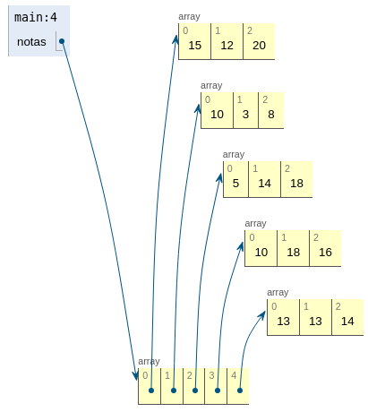
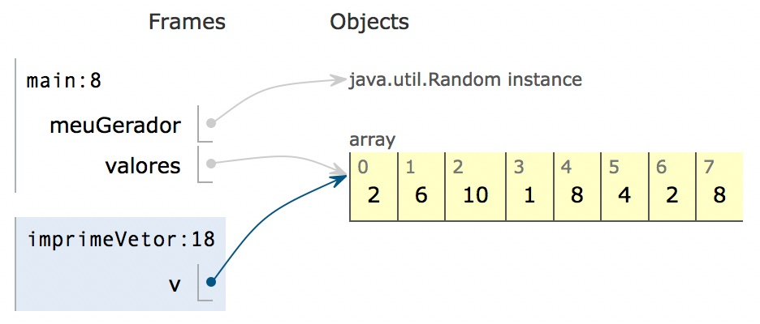

<!-- TOC -->

- [Nomenclatura](#nomenclatura)
  - [Classes](#classes)
  - [Variáveis e Métodos](#variáveis-e-métodos)
- [Comentários](#comentários)
  - [Documentação](#documentação)
- [Tipos de dados](#tipos-de-dados)
  - [Primitivos](#primitivos)
    - [Boolean](#boolean)
  - [Não primitivos](#não-primitivos)
- [Classes](#classes-1)
  - [Construtores](#construtores)
  - [Métodos](#métodos)
  - [Funções](#funções)
    - [Procedimentos](#procedimentos)
  - [Comparação de Objetos](#comparação-de-objetos)
  - [Algumas Classes](#algumas-classes)
    - [String](#string)
      - [StringBuilder](#stringbuilder)
    - [Random](#random)
  - [Jogador](#jogador)
- [IO](#io)
  - [STDIN](#stdin)
  - [STDOUT](#stdout)
- [Precedências](#precedências)
- [Declaração de variáveis](#declaração-de-variáveis)
- [Operadores](#operadores)
  - [Soma](#soma)
    - [Concatenação](#concatenação)
  - [Divisão](#divisão)
  - [Quociente e Resto](#quociente-e-resto)
- [Condicionais](#condicionais)
  - [Comparação Números Reais](#comparação-números-reais)
  - [Switch](#switch)
  - [Expressões condicionais (ternary)](#expressões-condicionais-ternary)
- [Ciclos](#ciclos)
  - [Atalhos](#atalhos)
    - [For-each](#for-each)
  - [While e Do...While](#while-e-dowhile)
- [Arrays](#arrays)
  - [Arrays Unidimensionais (Vetores)](#arrays-unidimensionais-vetores)
  - [Arrays Multidimensionais](#arrays-multidimensionais)
  - [Copiar Arrays](#copiar-arrays)
  - [Afetar Arrays (em métodos)](#afetar-arrays-em-métodos)
  - [Comparação de Arrays](#comparação-de-arrays)
- [Garbage Collector](#garbage-collector)

<!-- /TOC -->

## Nomenclatura

CaSe sENsiTiVe

### Classes

Começam com letra maiúscula (UpperCamelCase) e as conjunções de palavras também: `NomeDaClasse`.

### Variáveis e Métodos

Métodos começam com letra minúscula (camelCase) e as conjunções começam com letra maiúscula: `taxaImposto`.

Podem começar por `$` ou `_` mas são usados em código de mais baixo nível.

Não podem ser palavras reservadas: `if`, `break`, ...

## Comentários

```java
// Uma linha

/*
    Bloco
*/

/** 
  * Java doc
  */
```

### Documentação

```java
/**
  * Descrição do método
  * @param nomeParametro descrição do parametro
  * @return Descrição do resultado da função (opcional. Para )
  */
```

## Tipos de dados

### Primitivos
Por defeito não são inicializados e atiram uma exceção por não estarem inicializados. 

Tipos do Java. Não são classes.

- int
- double
- float
- boolean
- char (definido como `'a'`)
- ...

Exemplos

```java
10 // int
22.3 // double
250 + 120 // dois operandos int e o resultado é int
"Dias desde o inicio das aulas: 3" // string
```

#### Boolean

Universo de valores: `true` e `false`
Operações:

- `&&` and
- `&` and bit-a-bit
- `||` or
- `|` or bit-a-bit
- `!` not

Podem ser aplicados a numéricos o `>`, `<`, `>=`, `<=`, `==` e `!=` que retornam um `boolean`.

### Não primitivos
Por defeito são inicializados a `null`.

- Definidos por uma **Classe**.
- Valores (instâncias da classe) são **objetos**.
- Operações (tipo funções) são **métodos**.

Exemplos de tipos não primitivos:

- String
- Aluno
  - objeto que tem nome, número, turma, ...

## Classes

### Construtores
Invocados quando criamos um objeto `Jogador j = new Jogador()`.

Internamente, o objeto refere-se a si próprio com o `this`.

1. Reserva e afetação de memória para o novo objeto
2. Inicialização atribui com valores por defeito
3. Invocação no construtor indicado

Os construtores podem ter parâmetros
```java
public class Jogador {
  private Stringn nome; // null
  private int pontuacao; // 0
  private int maxJogada; // 0

  

  // Utilização
  public void main(String[] args) {
    Jogador j = new Jogador("Maria");
    Jogador j2 = new Jogador("Elsa", 20, 8);
  }
}
```

### Métodos

Os métodos não-estáticos chamam-se através de `nomeObjeto.nomeMétodo`
Os métodos estáticos chamam-se através de `NomeClasse.nomeMétodo`

```java
public class Main {
  public void main(String[] main) {
    String s1 = "Tigre";
    s1.charAt(0); //Caracter no índice 0. Valor: 'T'
    s1.charAt(5); //Atira uma exceção `IndexOutOfBoundsException` porque o índice 5 não existe na String s1
    s1.length(); //Comprimento da String. Valor: 5 

    String s2 = s1.toLowerCase(); // "Tigre" em minúsculas. Valor: "tigre"
  }
}
```

#### Getters e Setters
Uma boa prática é encapsular os atributos de uma classe. Por exemplo, o saldo de uma classe bancária não deve ser alterado pela classe cliente, apenas por levantamentos e depósitos.

Para aceder em métodos internos, deve-se usar os getters e setters em vez das propriedades.

Ver exemplo do `Jogador`

#### Overrides Uteis
##### toString
Para representarmos um objeto sobre a forma de *string* necessitamos de fazer override ao método `toString`.

Por exemplo:
```java
class Jogador { 
    // ...
    @Override
    public String toString() {
        return "Jogador{" +
            "nome='" + this.getNome() + '\'' +
            ", pontuacao=" + this.getPontuacao() +
            ", maxJogador=" + this.getMaxJogada() +
            '}';
    }
}
```

##### equals
Para comparar dois objetos da mesma classe, porque se for feito com o `==` compara-se apenas as referências.

Por exemplo:
```java
class Jogador {
  @Override
  public boolean equals(Jogador jogador) {
    return this.getPontuacao() == jogador.getPontuacao()
            && this.getMaxJogada() == jogador.getMaxJogada()
            && this.getNome().equals(jogador.getNome());
  }
}
```

##### clone

```java
class Jogador {
  public Jogador clone() {
    // NOTA: como a string é imutável não é necessário clonar!
    return new Jogador(this.getNome(), this.getPontuacao(), this.getMaxJogada());
  }
}
```

#### Funções

Processam e precisam de retornar algo.

```java
// tipo_retorno nome (tipo_parametro parametro, ...) { }

/**
  * Java doc
  */
static double media (int n1, int n2, int n3) {
    // Corpo do método
    return (n1 + n2 + n3) / 3;
}
```

<hr/>

Calcular nota final

```java
class Main {
  static void main(String[] args) {
    int nota = notaFinal(16.2, 18.3);
  }

  static int notaFinal(double exame, double trab) {
    double nota = exame * 0.70 + trab * 0.30;
    return (int) (nota + 0.5);
  }
}
```

#### Procedimentos

Não retornam mas normalmente afetam o objeto.

O tipo de retorno é `void`.

```java
static void imprimeTresLinhas() {
  System.out.println("linha");
  System.out.println("linha");
  System.out.println("linha");
}
```

### Comparação de Objetos

`boolean iguais = s1 == s2;` retorna `false`.

Porquê? `s1` e `s2` são objetos. Comparação entre eles são feitos pela referência.
Para comparar `String`s teríamos de usar o método `String::equals`

### Algumas Classes

#### String

`String s1 = "Tigre";`

A variável `s1` não temo valor "Tigre" mas sim uma referência ao objeto que tem o conteúdo.

`String s2 = s1;`

Como em java todos os objetos são referências, `s1` é uma referência. Quando atribuído ao `s2`, o valor da referência de `s1` é copiado para o `s2` e ficam ambos a apontar para o mesmo objeto em memória.

##### StringBuilder

Executar o seguinte bloco de código cria um novo objeto a cada iteração. No fim, o valor da String será "blablablabla", mas a String é um objeto imutável.
São criados 4 objetos para representar esta String, mas 3 são descartados.

```java
String s = "bla";
int n = 3;
for (int i=0; i<n; i++)
  s += "bla";
```

Para resolver isto, pode-se usar a classe `StringBuilder` para não estar constantemente a criar novos objetos.

```java
StringBuilder sb = new StringBuilder();
int n = 3;
for (int i=0; i<n; i++)
  sb.append("bla");

String s = sb.toString();
```

Exemplos de métodos do `StringBuilder`

```java
StringBuilder sb = new StringBuilder("ola"); // ola
sb.append(", bom dia"); // ola, bom dia
sb.insert(3, " Maria"); // ola Maria, bom dia
sb.setCharAt(0, "O"); //Ola Maria, bom dia
sb.delete(3, 9); //Ola, bom dia
```

#### Random

Gerar números aleatórios

```java
Random gerador = new Random();
int nAleatorio = gerador.nextInt(16); // [0, 16[
nAleatorio = gerador.nextInt(15) + 1; // [1, 15[ (no fundo [1, 14] )
```

Um objeto de `Random` necessita de uma semente. Se usar a mesma semente em dois objetos, a sucessão vai ser exatamente a mesma.

Ao criar um `Random` sem semente os valores vão ser sempre diferentes.

### Jogador

```java
public class Jogador {
  // Atributos
  private String nome;
  private int pontuacao;
  private int maxJogada;

  // region Construtores
  public Jogador(String n) {
    this.nome = n;

    // Desnecessário, escreve 0 quando já é 0
    this.pontuacao = 0;
    this.maxJogada = 0;
  }

  public Jogador(String nome, int pontuacao, int maxJogada) {
    this.nome = nome;
    this.pontuacao = pontuacao;
    this.maxJogada = maxJogada;
  }
  // endregion

  // region Getters
  public String getNome() {
    return this.nome;
  }

  public int getMaxJogada() {
    return this.maxJogada;
  }

  public int getPontuacao() {
    return this.pontuacao;
  }
  // endregion

  // region Setters
  public void setNome(String nome) {
    this.nome = nome;
  }

  public void adicionarPontuacao(int pontuacao) {
    this.pontuacao = pontuacao;
    if (this.maxJogada < pontuacao)
      this.maxJogada = pontuacao;
  }
  // endregion

  public Jogador clone() {
    // NOTA: como a string é imutável não é necessário clonar!
    return new Jogador(this.getNome(), this.getPontuacao(), this.getMaxJogada());
  }
  
  @Override
  public boolean equals(Jogador jogador) {
    return this.getPontuacao() == jogador.getPontuacao()
            && this.getMaxJogada() == jogador.getMaxJogada()
            && this.getNome().equals(jogador.getNome());
  }

  @Override
  public String toString() {
    return "Jogador{" +
            "nome='" + this.getNome() + '\'' +
            ", pontuacao=" + this.getPontuacao() +
            ", maxJogador=" + this.getMaxJogada() +
            '}';
  }
}
```

### Jogo
```java
class Jogo {
    private Jogador[] jogs;
    private int objetivo;
    private int quantos;
    
    public Jogo (int objetivo) {
        this.objetivo = objetivo;
        this.jogs = new Jogador[5]; // todas as posições do array são null
    }
    
    public int getObjetivo() {
        return this.objetivo
    }
    
    public void juntaJogador(String nome) {
        this.jogs[this.quantos] = new Jogador(nome);
        this.quantos++;
    }
}
```

## IO

### STDIN

Exposto pelo `System.in`, mas irá usar-se a classe `Scanner` para trabalhar o *input*.

```java
class Main {
  public static void main(String[] args) {

    Scanner leitor = new Scanner(System.in);
    StringBuilder sb = new StringBuilder();

    System.out.print("Insira o nome de aluno: "); // Escrever na consola para o utilizador
    sb.append(leitor.nextLine()); // Pede uma string ao utilizador
    sb.append("\n");

    System.out.print("Escreva a nota do exame de época normal: ");
    int e1 = leitor.nextInt(); // Pede um int ao utilizador
    System.out.print("Escreva a nota do exame de época de recurso: ");
    int e2 = leitor.nextInt();
    sb.append("Exame: ");
    sb.append(e1 > e2 ? e1 : e2);
    sb.append("\n");

    System.out.print("Escreva as 3 notas de dteste, separadas por espaço: ");
    double soma = 0;
    for (int i = 0; i < 3; i++) {
      double nota = leitor.nextDouble();
      soma += nota;
    }
    sb.append("Testes: ");
    sb.append(soma / 3);
    sb.append("\n");

    System.out.print(sb.toString());
  }
}
```

### STDOUT

Classe `System.out`.

`System.out.println` escreve na consola com `\n` no fim. (o `print` do python)
`System.out.print` escreve na consola sem `\n`

```java
// 250 + 120 = 370
System.out.print("250 + 120"); // imprime o texto
System.out.println(250 + 120); // imprime o resultado e muda de linha
```

## Precedências

1. Mutliplicação e Divisão
2. Soma e Subtração

## Declaração de variáveis

Tipagem forte, é obrigatório definir o tipo (ao contrário do Python).
Sem atribuir, a variável não tem valor. Em classes, o valor é `null`.
Os nomes das variáveis são únicos no seu scope.

```java
// Declaração
//   T nome;
int x, y;
double z;

// Atribuição
x = 3;

// Declaração com atribuição
int a = x / 10;
```

## Operadores

### Soma

#### Concatenação

```java
"Resultado = " + 250 // "Resultado = 250"
```

Mas com a precedência,

```java
// Por causa das precedências serem as mesmas (duas somas), o Java faz da esquerda para a direita. Concatena o "Resultado = " com 250 e depois "Resultado = 250" com 120.
// Isto resolve-se com parêntesis.
"Resultado = " + 250 + 120 // "Resultado = 250120".
```

### Divisão

Quando um dos operadores é real, a divisão é real. Caso contrário, a divisão é inteira.

```java
// x = 470
int z = x / 10; // z = 4

double w = x / 10; // w = 4.0. A divisão foi inteira.
w = x / 10.0; // w = 4.7. A divisão foi real.
```

### Quociente e Resto

```java
// x = 470
(x / 10) * 10 //
x % 10 //
```

## Condicionais

```java
// Uma linha
if (expressao_booleana)
  bloco_condicional;

// Várias linhas
if (expressao_booleana) {
  bloco_condicional;
  bloco_condicional;
  bloco_condicional;
}

// If then Else
if (expressao_booleana)
  se_verdadeiro;
else
  se_falso;
```

```java
// Função "complicada".
static boolean ePar(int n) {
  boolean result;
  if (n % 2 == 0)
    result = true;
  else
    retult = false;
  
  return result;
}

// Podemos não ter uma variável "result" e simplificar a função.
static boolean ePar(int n) {
  if (n % 2 == 0)
    return true;
  else
    return false;
}

// Se o if avalia para true, vamos retornar true. Caso contrário, retorna false.
// Podemos então simplificar para
static boolean ePar(int n) {
  return n % 2 == 0;
}
```

### Comparação Números Reais

```java
double x = 10.1
double r = x / 1.1;
r = r * 1.1;

// São exatamente iguais?
if (r == x) // false
  System.out.println("iguais!");
else
  System.out.println("diferentes!");
```

O resultado é "diferentes!" porque x = 10.1 e r = 10.099999999999998

Isto acontece por causa da precisão.

Uma solução é haver um threshold da diferença entre os dois.

```java
public static boolean iguais(double x, double y, double delta) {
  return Math.abs(x - y) < delta;
}

iguais(x, r, 0.001); // true
```

### Switch

If... else if... else if... vários desses

```java
switch (mes) {
  case 1: System.out.println("Janeiro");
  break;
  case 2: System.out.println("Fevereiro");
  break;
  case 3: System.out.println("Marco");
  break;
  case 4: System.out.println("Abril");
  break;
  case 5: System.out.println("Maio");
  break;
  case 6: System.out.println("Junho");
  break;
  case 7: System.out.println("Julho");
  break;
  case 8: System.out.println("Agosto");
  break;
  case 9: System.out.println("Setembro");
  break;
  case 10: System.out.println("Outubro");
  break;
  case 11: System.out.println("Novembro");
  break;
  case 12: System.out.println("Dezembro");
  break;
  default: System.out.println("Valor inválido!");
  break;
}
```

O `break` faz com que o `case` acabe. Sem ele, podemos encadear cases e criar comportamento comulativo.

O `default` é o caso executado quando nenhum dos casos anteriores é executado, como se fosse o último `else`.

### Expressões condicionais (ternary)

x = se n > 10 põe 1. se não põe 2
=> `x = n > 10 ? 1 : 2;`

Estas expressões necessitam obrigatoriamente dos dois valores. Não é como o `if` que pode não ter o `else`.

```java
int n = 10;
int x;

// If simples. Podemos fazer isto numa linha
if (n > 10)
  x = 1;
else
  x = 2;

//  exp_bool ? valorTrue : valorFalse
x = n > 10 ? 1 : 2;
```

Escrever o numero e se é Par ou Impar

```java
int n = 43;
System.out.println(n + ePar(n) ? " e' Par" : "e' Impar");
```

## Ciclos

### Atalhos

- `var++`

  ```java
  int i = 5;
  i++;  // i = i+1; ou i += 1
  ```

- `var--`

  ```java
  int j = 6;
  j--; // j = j-1; ou j -= 1
  ```

- `var += valor`
- `var -= valor`
- `var *= valor`

  ```java
  i *= j + 7; // i = i * (j + 7)
- `var /= valor`
- `var %= valor`

### For

Principalmente utilizado quando sabemos a quantidade de vezes que o ciclo itera.

```java
for (inicializacao; guarda; progresso)
  bloco_instruções
```

As declarações de variáveis dentro do `for` (inclusive na inicialização) são limpas de memória quando o ciclo termina.

A inicialização, guarda, e progresso são opcionais. Podemos ter ciclos sem inicialização (usam variáveis já definidas), sem guarda (usam `break;` para terminar o ciclo no bloco_instruções), e/ou sem progresso (pode ser feito no bloco_instruções).

O progresso deve-se aproximar da falsificação da guarda.
O seguinte ciclo é "infinito" (faz underflow) pois não se aproxima da falsificação da guarda - começa a 1 e vai diminuindo, logo não chega a 10.

```java
for (int i=1; i<=10; i--) {
  System.out.println(i);
}
```

Exemplos:

- Imprime "la\n" 10 vezes
  1. Inicializa i como inteiro com valor 1
  2. Avalia a guarda. Se verdadeiro execucta o bloco. Cc acaba
  3. Progresso
  4. Voltar ao ponto 2.

  ```java
  for (int i=1; i<=10; i++)
    System.out.println("la");
  ```

- Imprimir os números pares de 1 a 20

  ```java
  for (int i=1; i<=20; i++) {
    if (i % 2 == 0)
      System.out.println(i);
  }
  ```

  Mas esta solução tem de fazer a pergunta "é par" a todas as iterações. Podemos ter antes:

  ```java
  for (int i=1; i<=10; i++) {
    System.out.println(i * 2);
  }
  ```

  Ou ter antes a seguinte solução para `i` ser sempre par no corpo do ciclo.

  ```java
  for (int i=2; i<=20; i+=2) {
    System.out.println(i);
  }
  ```

- Imprimir `n` asteriscos em 4 linhas

```java
int n = ?;
for (int i=1; i<=4; i++) {
  // Imprimir n asteriscos
  
  for (int j=1; j<=n; j++) {
    System.out.print("*");
  }

  // Mudança de linha, se não os asteriscos ficam todos na mesma linha
  System.out.print("\n");
}
```

- Menor divisor de n que seja maior que um

```java
static int menorDivisorMaiorQueUm(int n) {
  int resultado = n;
  for (int i=2; i<=n/2 && resultado == n; i++) {
    // Verificar se é divisor de n
    if (n % i == 0)
      resultado = i;
  }

  return resultado;
}
```

#### For-each

`for (tipo valor : iterador)` (para `valor` em `iterador`)
Percorre um iterador por ordem

```java
for (int e : v)
  System.out.print(e + " ");
System.out.println();
```

Seria equivalente a:

```java
for (int i=0; i<v.length; i++) {
  int e = v[i];
  System.out.print(e + " ");
}
System.out.println();
```

- Pode ser usado em *arrays* multidimensionais:

```java
// int[][] v
for (int[] linha : v) {
  for (int e : linha)
    System.out.print(e + " ");
}
System.out.println();
```

Seria equivalente a:

```java
for (int i=0; i<v.length; i++) {
  for (int j=0; j<v[i].length; j++)
    System.out.print(v[i][j] + " ");
}
System.out.println();
```

### While e Do...While

Principalmente utilizado quando não sabemos a quantidade de vezes que o ciclo itera.

- While

  ```java
  while (expressao_booleana) //Enquanto verdade faz "bloco_instrucoes"
    bloco_instrucoes
  ```

  Exemplo:

  ```java
  static int algarismoEsq(int num) {
    while (num >= 10)
      num /= 10;
    
    return num;
  }

  algarismoEsq(123); // 1
  ```

  ```java
  static int qtdAlgarismos(int num) {
    int cnt = 1;
    while (num >= 10) {
      num /= 10;
      cnt++;
    }
    
    return cnt;
  }

  qtdAlgarismos(123); // 3
  ```

- Do...While
  A diferença entre o `while` e o `do...while` é que o primeiro executa a guarda no início. O `do...while` executa no fim, portanto o corpo é executado pelo menos uma vez.

  ```java
  do {
    bloco_instrucoes
  } while (expressao);
  ```

  Exemplo:

  ```java
  static int qtdAlgarismos(int num) {
    int cnt = 0;
    do {
      num /= 10;
      cnt++;
    }
    while (num >= 10) {
    
    return cnt;
  }

  qtdAlgarismos(123); // 3
  ```

## Arrays

Tipo não primitivo. Todos os elementos do *array* são do mesmo tipo.

Os índices vão de `0` até `array::length - 1`

### Arrays Unidimensionais (Vetores)

Declaração:

- `int[] vetor = new int[5]` (são inicializados 5 elementos a 0)
- `int[] vetor = { 11, 7, 5, 8, 3 }` (são inicializados 5 elementos com os valores)

Indexação:
`vetor[indice]`

No exemplo abaixo há uma cópia dos argumentos para os parâmetros. O valor de `myV` (uma referência) é copiado para ser usado pelo parâmetro `v`.
No fundo, são as mesmas referências.

```java
public static void main() {
  int[] myV = new int[5];
  inprimeVetor(myV);
}

static void imprimeVetor(int[] v) {
  for (int i=0; i<v.length; i++)
    System.out.println(v[i]);
}
```

TODO

- Ver como se pode copiar de um array para o outro
- Método que constroi e devolve um array

### Arrays Multidimensionais

`int[][] matriz = new int[5][3];`

Indexação:
`matriz[indice][indice]`

```java
public static void main() {
  // int[][] notas = new int[5][3];
  // ou
  int[][] notas = { {15, 12, 20 }
                  , {10, 3, 8}
                  , { 5, 14, 18}
                  , {10, 18, 16}
                  , {13, 13, 14} };
}
```



Exemplo de percorrer um array bidimensional

```java
void imprimeArrayBi(int[][] m) {
  for(int i=0; i<m.length(); i++) {
    for (int j=0; j<m[i].lenght(); j++) {
      System.out.print(m[i][j] + " ");
    }
    System.out.println();
  }
}
```

### Copiar Arrays

### Afetar Arrays (em métodos)

É preciso prestar atenção quando se afetam *arrays* em métodos, pois são referênciados e, fora do método, as alterações são sentidas.



```java
public static void main() {
  int[] myV = new int[5];
  // imaginar que existe código que atribui valores

  // tornar todos os valores <10 igual a 10
  alteraValoresInferiores(myV, 10);

  // myV sente as alterações efetuadas no método alteraValoresInferiores
}

// Não precisa de retornar o array porque é afetado
static void imprimeVetor(int[] v, int min) {
  for (int i=0; i<v.length; i++) {
    if (v[i] < min)
      v[i] = min;
  }
}
```

### Comparação de Arrays

`v1 == v2` NÃO deve ser feito, pois só compara as referências.
Para comparar os valores, devemos percorrer os *arrays*:

```java
boolean saoIguais(int[] v1, int[] v2) {
  // Só são iguais se o comprimento for igual. Sem isto, podemos ter erros de indexação
  if (v1.length() != v2.length())
    return false;

  for (int i=0; i<v1.length(); i++)
    if (v1[i] != v2[i]) // Só quando um elemento é diferente é que acabamos a função.
      return false;
  
  // Se todos são iguais, retornamos true
  return true;
}

// ou com extensão da guarda
boolean saoIguais(int[] v1, int[] v2) {
  // Só são iguais se o comprimento for igual. Sem isto, podemos ter erros de indexação
  boolean iguais = v1.length() == v2.length();

  // enquanto não chegar ao fim e forem iguais, percorre
  for (int i=0; i<v1.length() && iguais; i++)
    if (v1[i] != v2[i]) // Só quando um elemento é diferente é que acabamos a função.
      iguais = false;
  
  // Se todos são iguais, retornamos true
  return iguais;
}
```

## Garbage Collector

Trata de descartar os objetos que já não são referenciados.
