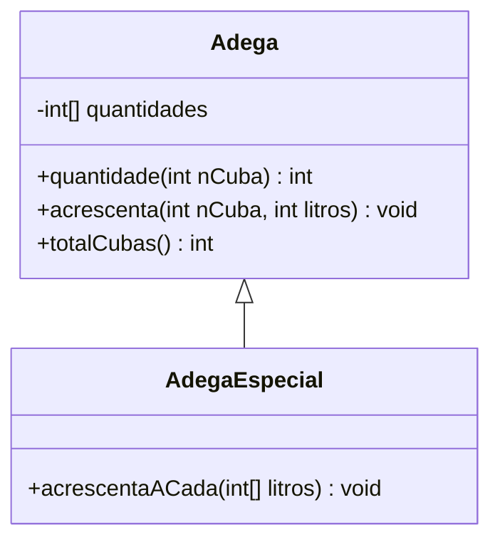

# Exercicios Série 4
## Herança
2. Considere as seguintes classes. Identifique os vários problemas que o compilador assinalará. Justifique a sua resposta.
```java
public class A {
    private int v;
    
    public A(int i) {
        this.v = i;
    }
    
    public int v() {
        return this.v + this.x;
    }
}
```
```java
public class B extends A {
    private int x;
    
    public B() {
        this.x = 1.0;
    }
    
    public B(int i, int j) {
        this.v = i;
        this.x = j;
    }
}
```
- Classe A
  - o atributo `x` não existe
- Classe B
  - o atributo `v` não existe em `B` (somente em `A`)
  - `1.0` é um literal de tipo `double` associado a um atributo do tipo `int`
  - os construtores não invocam o instrutor da superclasse
    - o compilador coloca, por omissão, `super()`, mas `A` não tem esse construtor 

3. Considere as seguintes classes.
```java
public class A {
    private int v;
    public static final int FIRST = 3;
 
    public A() {
        this.v = FIRST;
    }
    
    public A(int i) {
        this.v = i;
    }
 
    public int value() {
        return this.v;
    }
}
```
```java
public class B extends A {
    private double x;
    
    public B() {
        this.x = this.value() * 2;
    }
    
    public B(int i) {
        super();
        this.x = i;
    }
    
    public B(int i, int j) {
        super(i);
        this.x = j;
    }
    
    public double x() {
        return this.x;
    }
}
```

O que apareceria no ecrã caso se executasse cada uma das sequências de instruções que se seguem:
- a) `B b = new B(); System.out.println(b.value() + " " + b.x());`
  - 3 6.0
- b) `B b = new B(4); System.out.println(b.value() + " " + b.x());`
  - 3 4.0
- c) `B b = new B(3, 2); System.out.println(b.value() + " " + b.x());`
  - 3 2.0

4. Considere as classes `Adega` e `AdegaEspecial` definidas abaixo.
```java
public class Adega {
    private int[] quantidades;
    
    /**
    * Inicializa o novo objeto
    * @param nCubas O numero de cubas que a nova adega vai ter
    * @requires nCubas > 0
    */
    public Adega (int nCubas) {
        this.quantidades = new int [nCubas];
    }
    
    /**
    * Quantidade de líquido numa dada cuba
    * @param nCuba Numero de ordem da cuba
    * @return Quantidade de líquido na cuba numero nCuba
    * @requires nCuba >= 0 && nCuba < this.totalCubas()
    */
    public int quantidade(int nCuba) {
        return this.quantidades[nCuba];
    }
    
    /**
    * Acrescenta liquido a uma dada cuba
    * @param nCuba Numero de ordem da cuba
    * @param litros Numero de litros a acrescentar
    * @requires nCuba >= 0 && nCuba < this.totalCubas() && litros > 0
    */
    public void acrescenta(int nCuba, int litros) {
        this.quantidades[nCuba] += litros;
    }
    /**
    * Quantas cubas tem a adega?
    * @return
    */
    public int totalCubas() {
        return this.quantidades.length;
    }
}
```
```java
public class AdegaEspecial extends Adega {
    /**
    * Inicializa o novo objeto
    * @param nCubas O numero de cubas que a nova adega vai ter
    * @requires nCubas > 0
    */
    public AdegaEspecial (int nCubas) {
        super(nCubas);
    }
    
    /**
    * Acrescenta 'as cubas desta adega quantidades de liquido dadas
    * @param litros As quantidades a acrescentar 'as cubas, pela mesma
    * ordem da ordem das cubas
    * @requires litros != null && litros.length == this.totalCubas()
    */
    public void acrescentaACada(int[] litros) {
        for(int i = 0 ; i < this.totalCubas() ; i++) {
            this.acrescenta(i, litros[i]);
        }
    }
}
```

- a) Apresente um diagrama UML que capture a estrutura dessas classes e a forma como se relacionam.

[Mermaid (gráfico)](https://mermaid-js.github.io/mermaid/#/./classDiagram)

- b) Diga, justificando, se as seguintes instruções são aceites pelo compilador.
  0. `int[] v = {25, 12, 30, 22, 60, 55};` sim
  1. `Adega a1 = new Adega(6);` sim
  2. `AdegaEspecial ea1 = new AdegaEspecial(4);` sim
  3. `Adega a2 = new AdegaEspecial(7);` sim
  4. `AdegaEspecial ea2 = new Adega(3);` não, `Adega` não é compatível com `AdegaEspecial`
  5. `ea1.acrescenta(1,25);` sim
  6. `ea1. acrescentaACada(v);` sim
  7. `a2.acrescenta(3,10);` sim
  8. `a1.acrescentaACada(v);` não, `Adega` não tem o método `acrescentaACada`
  9. `a2.acrescentaACada(v);` não, `Adega` não tem o método `acrescentaACada`
  10. `a2 = ea1;` sim
  11. `ea1 = a2;` não, `Adega` não é compatível com `AdegaEspecial`
  12. `int x = a1.quantidade(1);` sim
  13. `x = a2.quantidade(1);` sim
  14. `x = ea1.quantidade(1);` sim
  15. `a1.acrescenta(3,-10);` sim

- c) Contando somente com as instruções corretas, represente o estado do sistema à medida que as instruções são
  executadas.
- d) Que métodos podem ser invocados sobre `a1`, `ea1` e `a2`? Justifique.
Sobre `a1` e `a2` podem ser invocados os métodos públicos da classe `Adega` que incluem todos os métodos de `Object`
Sobre `ea1` podem ser invocados os métodos públicos da classe `AdegaEspecializada` que incluem todos os métodos públicos da classe `Adega`

5. Considere de novo a classe Adega definida no exercício 4
- a) Fazendo uso da herança, crie uma classe que represente uma adega comunitária (ver API) em que quando se acrescenta vinho a uma cuba, se o resultado de adicionar essa nova quantidade à quantidade já existente nessa cuba for superior à quantidade máxima existente nalguma cuba da adega, a quantidade a acrescentar deverá ser distribuída por todas as cubas da adega.

```java
public class Adega {
  private int[] quantidades;

  /**
   * Inicializa o novo objeto
   * @param nCubas O numero de cubas que a nova adega vai ter
   * @requires nCubas > 0
   */
  public Adega(int nCubas) {
    this.quantidades = new int[nCubas];
  }

  /**
   * Quantidade de líquido numa dada cuba
   * @param nCuba Numero de ordem da cuba
   * @return Quantidade de líquido na cuba numero nCuba
   * @requires nCuba >= 0 && nCuba < this.totalCubas()
   */
  public int quantidade(int nCuba) {
    return this.quantidades[nCuba];
  }

  /**
   * Acrescenta liquido a uma dada cuba
   * @param nCuba Numero de ordem da cuba
   * @param litros Numero de litros a acrescentar
   * @requires nCuba >= 0 && nCuba < this.totalCubas() && litros > 0
   */
  public void acrescenta(int nCuba, int litros) {
    this.quantidades[nCuba] += litros;
  }

  /**
   * Quantas cubas tem a adega?
   * @return
   */
  public int totalCubas() {
    return this.quantidades.length;
  }
}

public class EcoAdega extends Adega {
  public EcoAdega(int nCubas) {
    super(nCubas);
  }
  
  private int maxLitrosCubas() {
    int qtdCubas = this.totalCubas();
    int max = this.quantidade(0);

    for (int i=0; i<qtdCubas; i++) {
      int qtd = this.quantidade(i);
      if (qtd > max)
        max = qtd;
    }
    
    return max;
  }

  /**
   * 
   * @param nCuba Numero de ordem da cuba
   * @param litros Numero de litros a acrescentar
   * @requires nCuba >= 0 && nCuba < this.totalCubas() && litros > 0
   */
  @Override
  public void acrescenta(int nCuba, int litros) {
    int qtdCubas = this.totalCubas();
      
    if (this.quantidade(nCuba) + litros > this.maxLitrosCubas()) {
      int nLitros = litros / qtdCubas;
      
      for (int i=0; i<qtdCubas; i++)
          super.acrescenta(i, nLitros);
    } else
        super.acrescenta(nCuba, litros);
  }
}
```

7. Considere as classes `Adega` e `AdegaEspecial` definidas anteriormente e a classe:
```java
public class AdegaPlus extends AdegaEspecial {
  private int nRecargas;
  
  /**
  * Inicializa o novo objeto
  * @param nCubas O numero de cubas que a nova adega vai ter
  * @requires nCubas > 0
  */
  public AdegaPlus (int nCubas) {
      super(nCubas);
  }
  
  /**
  * Acrescenta liquido a uma dada cuba ou uma parte desse liquido
  * a todas as cubas no caso de, com esse liquido extra, essa cuba
  * se tornar a cuba com maior quantidade
  * @param nCuba Numero de ordem da cuba 'a qual acrescentar
  * @param litros Numero de litros a acrescentar
  * @requires nCuba >= 0 && nCuba < this.totalCubas() && litros > 0
  */
  @Override
  public void acrescenta(int nCuba, int litros) {
      super.acrescenta(nCuba, litros);
      this.nRecargas++;
  }
  
  /**
  * Quantas recargas ja' foram feitas nesta adega
  */
  public int quantasRecargas() {
      return this.nRecargas;
  }
}
```

- b) Qual é o resultado produzido pelo seguinte pedaço de código? Justifique, descrevendo as instruções que vão sendo executadas e o estado dos objetos.
  - `quantidades: null; nRecargas: 0`
  1. `AdegaPlus ap = new AdegaPlus(6);`
     - `quantidades: [0, 0, 0, 0, 0, 0]; nRecargas: 0`
  2. `ap.acrescenta(2, 25);`
     - `quantidades: [0, 0, 25, 0, 0, 0]; nRecargas: 1` 
  3. `int[] v = {25, 12, 30, 22, 60, 55};`
     - ...
  4. `ap.acrescentaACada(v);`
     - `quantidades: [25, 12, 55, 22, 60, 55]; nRecargas: 7` 
  5. `System.out.println(ap.quantasRecargas());`
     - Imprime no ecrã o valor de `nRecargas` que é `1`
  
9. Considere as seguintes classes:
```java
public class Person {
    private String name, surname;
    
    public void setFirstname(String n) {
        this.name = n;
    }
    
    public void setSurname(String n) {
        this.surname = n;
    }
    
    public String getFirstname() {
        return this.name;
    }
    
    public String getSurname() {
        return this.surname;
    }
    
    public String getName() {
        return getFirstname() + " " + getSurname();
    }
    
    public String toString() {
        return "My name is " + getName();
    }
}

public class Agent extends Person {
  public String getFirstname() {
    return "";
  }
}
```

- a) Apresente o “output” produzido pela seguinte sequência de comandos:
  1. `Agent a = new Agent();`
     - `name: null; surname: null` 
  2. `a.setSurname("Bond");`
     - `name: null; surname: "Bond"`
  3. `a.setFirstname("Jaime");`
     - `name: "Jaime"; surname: "Bond"`
  4. `System.out.println(a.toString());`
     - `"My name is  Bond"`
- b) Altere a classe `Agent`, sem remover nem alterar o método `getFirstname` que aí se encontra implementado, por forma a que o “output” da sequência de instruções apresentada na alínea anterior seja `"My name is Bond, Jaime Bond"`.

```java
public class Agent extends Person {
  @Override
  public String toString() {
    return "My name is " + getLastName() + ", " + super.getName();
  }

  public String getFirstname() {
    return "";
  }
}
  ```